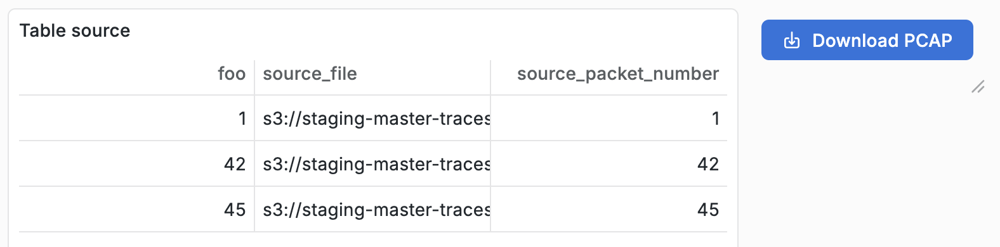
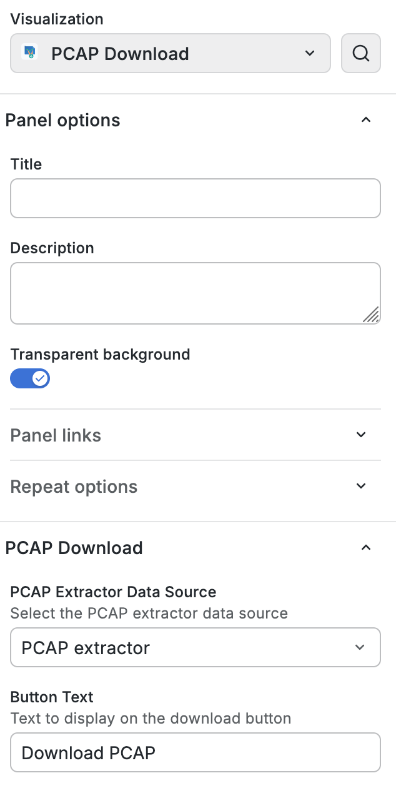

# PCAP Extractor

This custom emnify plugin facilitates with the extraction and download of PCAP files based on PCAP Parser / IMSI-based Observability. 

Go to the included _PCAP Extractor Data Source_ configuration and then add a _PCAP Download_ button panel.

## Usage

- Query PCAP data, make sure that results include columns `source_file` and `source_packet_number`.
- Add a panel of type `PCAP download`.
- Configure the panel and pick the `emnify-pcap-extractor` data source that should be available after successful provisioning.

| Panel appearance                                        | Panel configuration                                        |
|---------------------------------------------------------|------------------------------------------------------------|
|  |  |
